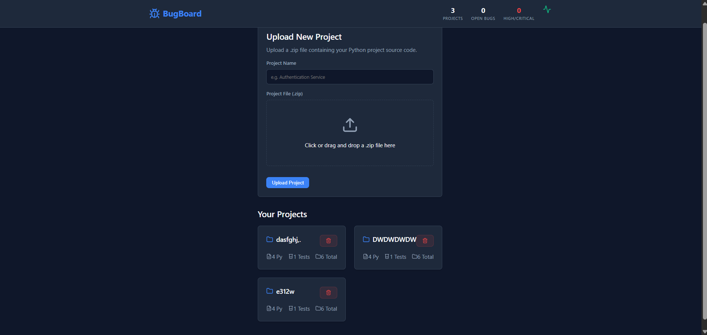
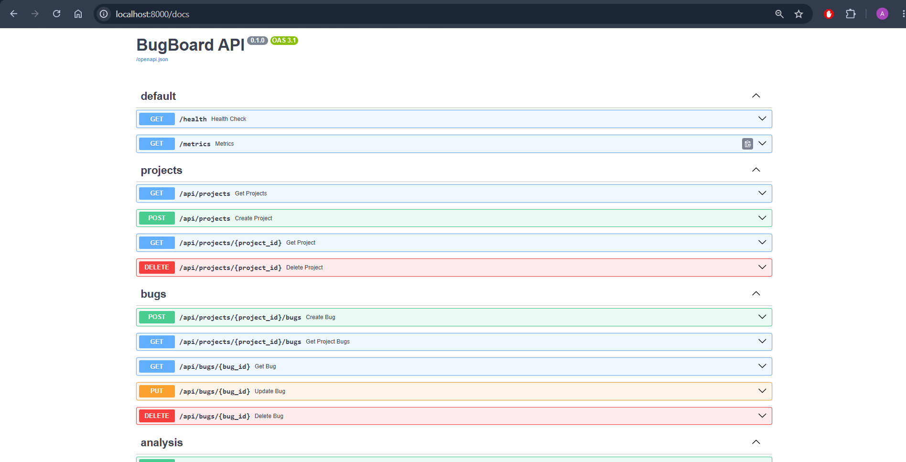
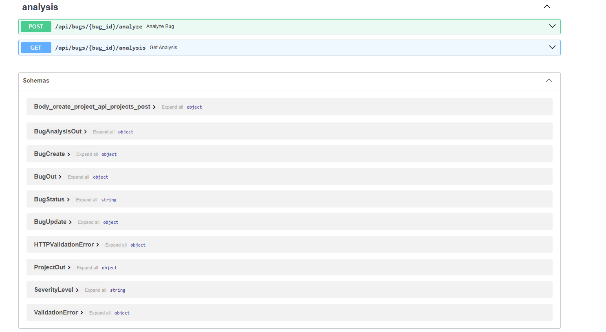
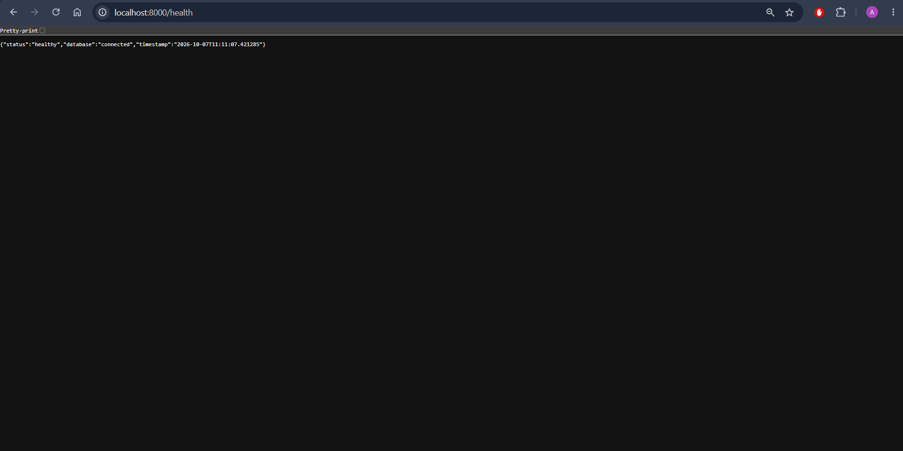
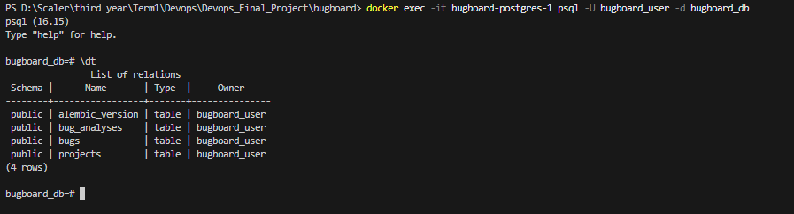

# Module 1 (M1) — Application: Frontend + Backend + Database

This document provides evidence for the completion of the M1 module requirements for the BugBoard Capstone project.

## Grading Criteria Checklist

| Criterion | Points | Status |
| :--- | :---: | :--- |
| FastAPI backend starts and responds to `/health` | 2 | ✅ Completed |
| Minimum 4 REST API endpoints implemented (GET, POST, PUT, DELETE) | 3 | ✅ Completed |
| PostgreSQL database with at least one table managed by Alembic migrations | 2 | ✅ Completed |
| React/HTML frontend renders and makes API calls | 2 | ✅ Completed |
| Responsive and usable UI (not a blank page) | 1 | ✅ Completed |

---

## Submission Artifacts

The following required files have been implemented and pushed to the repository:
- `backend/app/` — all Python source files (models, schemas, routes, database config)
- `backend/alembic/versions/` — at least one migration file (present)
- `backend/requirements.txt` — populated with dependencies
- `frontend/` — all frontend source files
- `docker-compose.yml` — working stack definition

---

## Application Evidence

> **Note to self:** Replace the placeholders below with actual screenshots or a short screen recording of the running application in the browser.

### 1. Dashboard / UI View

### 2. API / Swagger Docs And Health

### 3. Database

