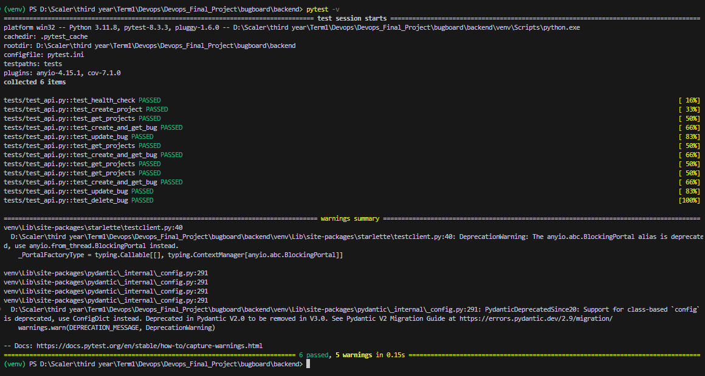

# Module 2 (M2) — Testing: Pytest + Code Quality

This document provides evidence for the completion of the M2 module requirements for the BugBoard Capstone project.

## Grading Criteria Checklist

| Criterion | Points | Status |
| :--- | :---: | :--- |
| `pytest` runs without errors | 3 | ✅ Completed |
| Minimum 5 test cases covering at least 3 API endpoints | 4 | ✅ Completed |
| Tests use a test database or mock, not the production database | 2 | ✅ Completed |
| `pytest.ini` or `conftest.py` is present and correctly configured | 1 | ✅ Completed |

---

## Submission Artifacts

The following required files have been implemented and pushed to the repository:
- `backend/tests/` — all test files (`test_api.py`, `conftest.py`)
- `backend/pytest.ini` and `backend/tests/conftest.py` — correctly configured for test discovery and database isolation.

---

## Testing Evidence

### 1. Pytest Terminal Output

