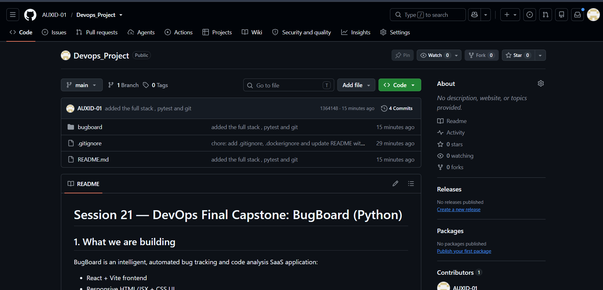
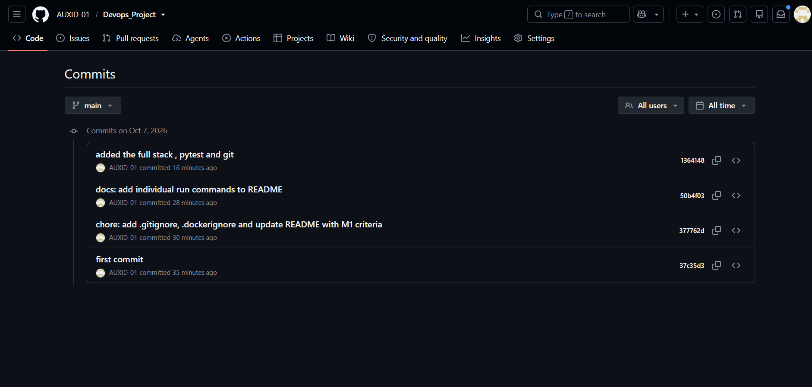

# Module 3 (M3) — Git and GitHub

This document provides evidence for the completion of the M3 module requirements for the BugBoard Capstone project.

## Grading Criteria Checklist

| Criterion | Points | Status |
| :--- | :---: | :--- |
| Public GitHub repository linked in the submission form | 2 | ✅ Completed |
| Meaningful commit messages (not "update", "fix", "test") | 2 | ✅ Completed |
| `.gitignore` excludes `.env`, `__pycache__`, `node_modules`, `.venv` | 1 | ✅ Completed |

---

## Submission Artifacts

The following required items have been implemented:
- **GitHub Repository URL**: `https://github.com/AUXID-01/Devops_Project.git`

---

## Git Evidence

### 1. Commit History ()

