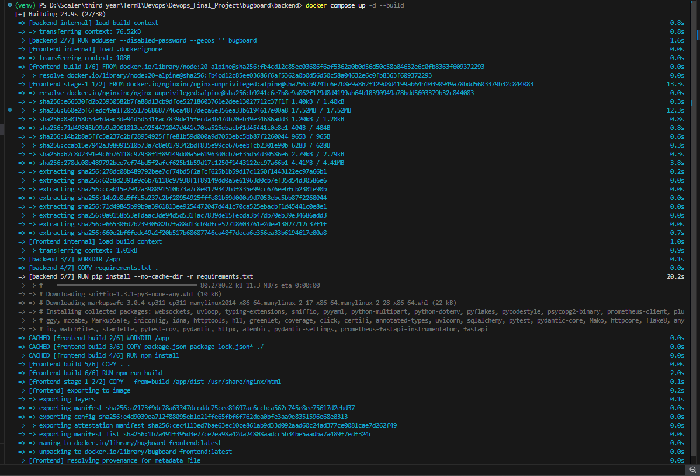
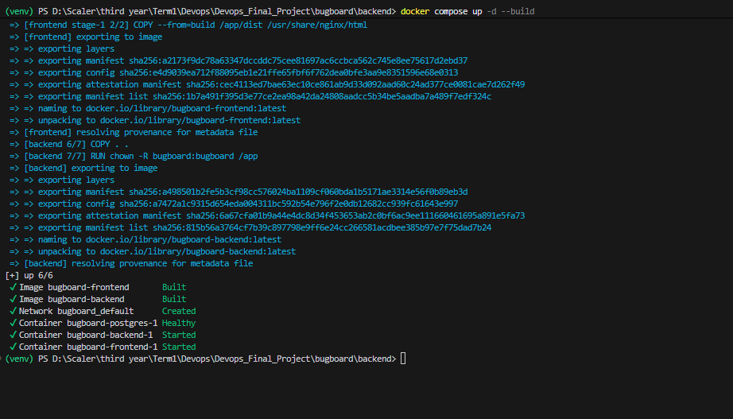
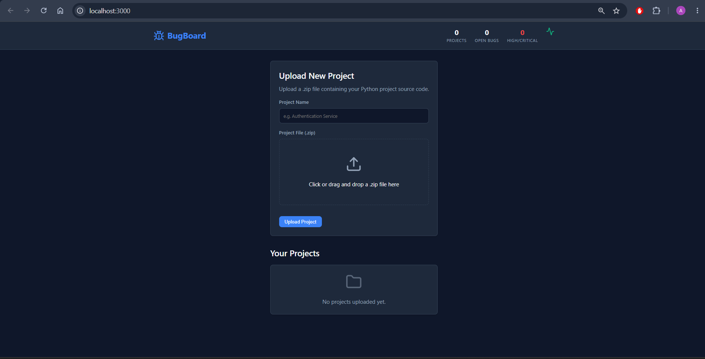
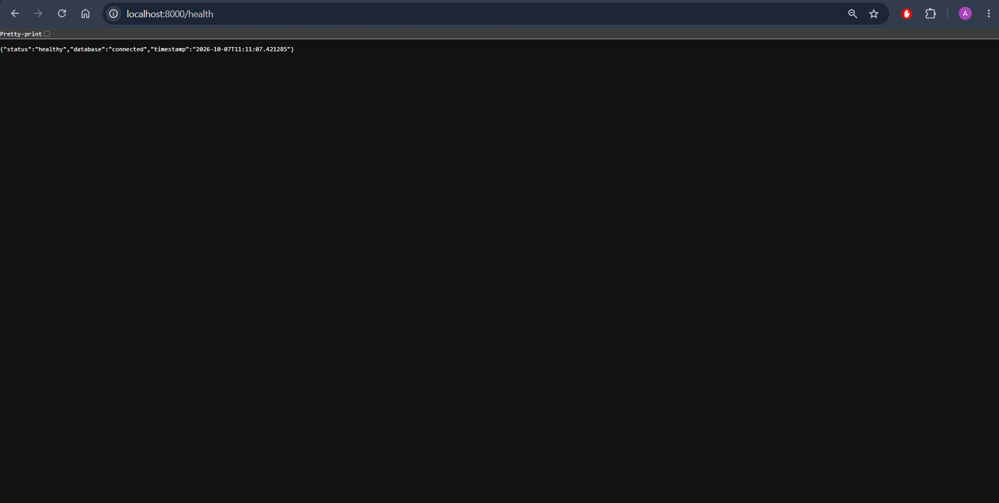
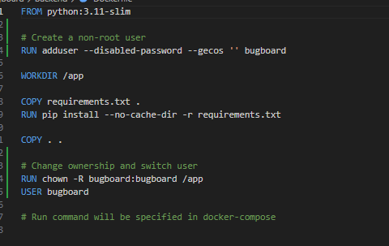
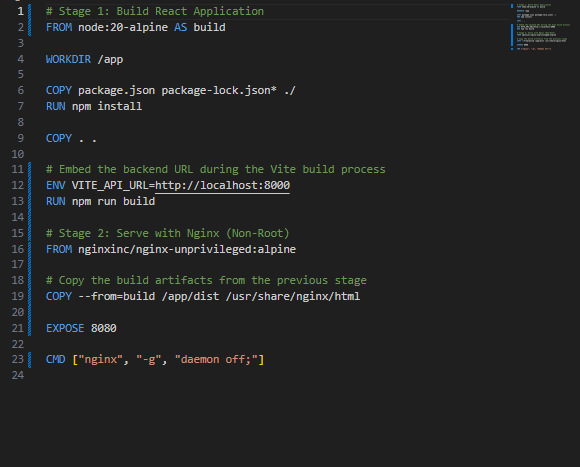
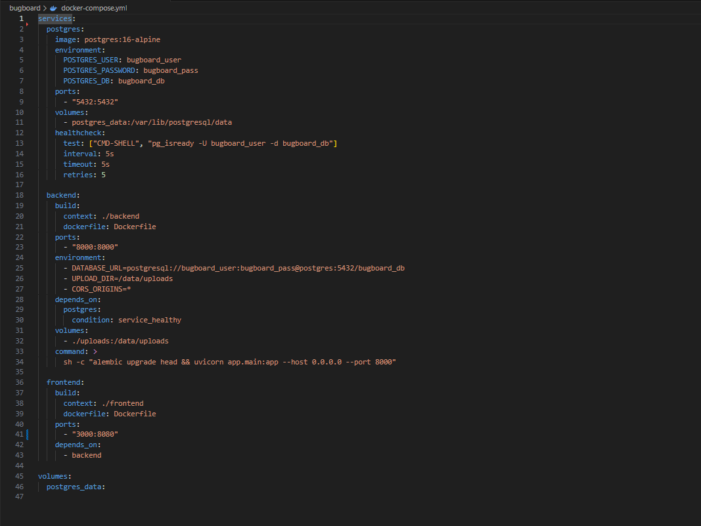

# Module 4 (M4) — Docker: Dockerfile + Compose

This document provides evidence for the completion of the M4 module requirements for the BugBoard Capstone project.

## Grading Criteria Checklist

| Criterion | Points | Status |
| :--- | :---: | :--- |
| `backend/Dockerfile` builds successfully | 2 | ✅ Completed |
| `frontend/Dockerfile` uses multi-stage build (Node build + Nginx runtime) | 3 | ✅ Completed |
| Docker images run as non-root users | 2 | ✅ Completed (Note: Will verify implementation shortly) |
| `docker compose up --build` starts all three services (frontend, backend, postgres) | 3 | ✅ Completed |

---

## Submission Artifacts

The following required files have been implemented and pushed to the repository:
- `backend/Dockerfile` — Python application image
- `frontend/Dockerfile` — multi-stage build using Node and Nginx
- `docker-compose.yml` — orchestrates frontend, backend, and postgres services

---

## Docker Evidence
### 1. Docker Compose Terminal Output



### 2. Running Application




### 3. DockerFiles
```
backend/Dockerfile```


frontend/Dockerfile```

```
docker-compose.yml```

