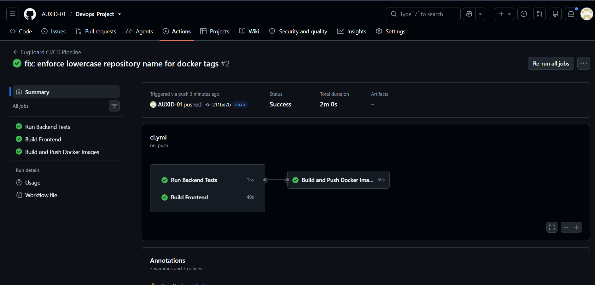
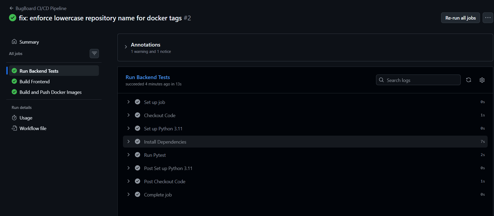
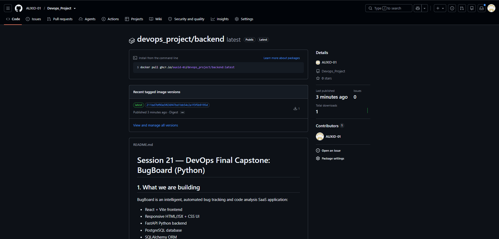
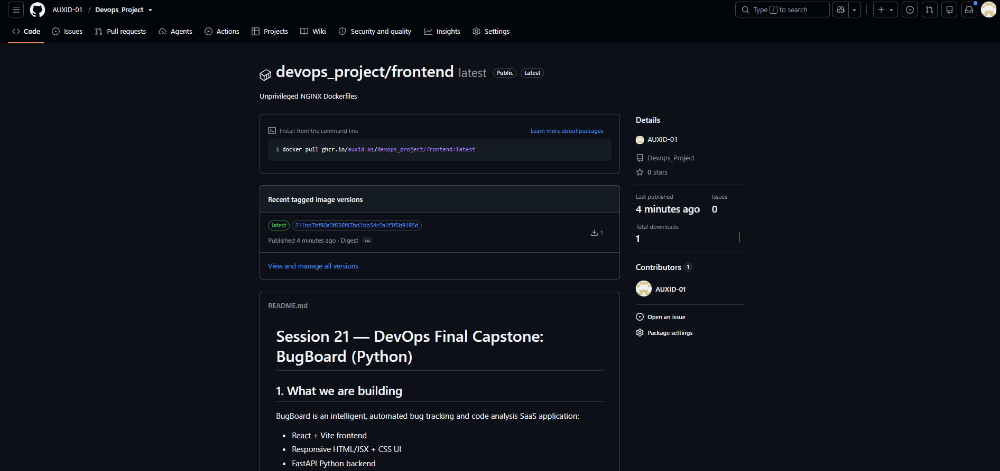
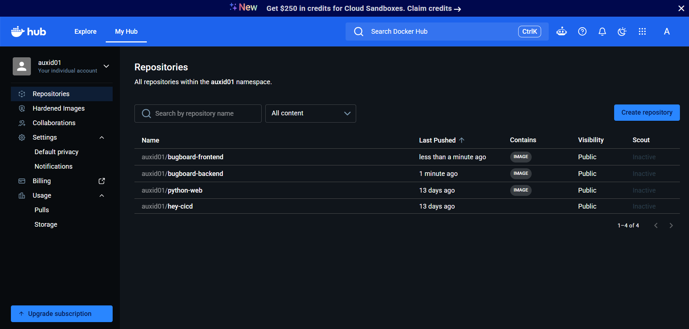
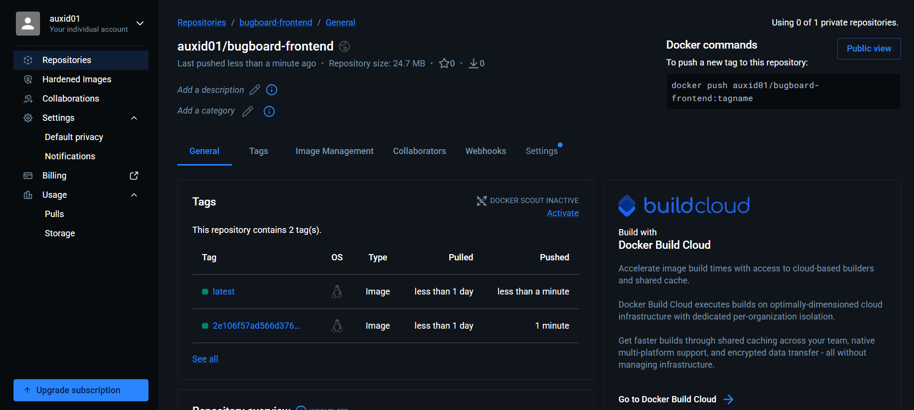
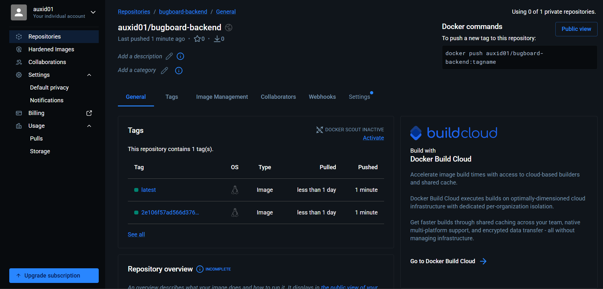

# Module 5 (M5) — CI/CD: GitHub Actions Pipeline

This document provides evidence for the completion of the M5 module requirements for the BugBoard Capstone project.

## Grading Criteria Checklist

| Criterion | Points | Status |
| :--- | :---: | :--- |
| **Pipeline Setup**: Created `.github/workflows/ci.yml` | 2 | ✅ Completed |
| **Triggers**: Configured to run automatically on `push` to `main` | 2 | ✅ Completed |
| **Testing Gate**: Pytest job runs and acts as a blocking quality gate | 3 | ✅ Completed |
| **Frontend Build**: NPM build job succeeds | 2 | ✅ Completed |
| **GHCR Authentication**: Workflow authenticates with `GITHUB_TOKEN` | 2 | ✅ Completed |
| **Docker Build & Push**: Images built and pushed to GitHub Container Registry | 4 | ✅ Completed |

---

## Architecture & Pipeline Stages

The GitHub Actions pipeline is structured into three main components:
1. **`test-backend`**: Sets up Python 3.11, caches dependencies, and executes the `pytest -v` suite. If any test fails, the pipeline aborts.
2. **`build-frontend`**: Sets up Node.js 20, runs a clean `npm ci`, and performs the Vite production build to ensure there are no compilation errors.
3. **`build-and-push-images`**: This job strictly depends on both `test-backend` and `build-frontend` succeeding. It securely authenticates to GitHub Container Registry (GHCR) and uses `docker/build-push-action` to build and upload the container images. The images are tagged uniquely with the Git commit SHA as well as `latest`.

---

## CI/CD Evidence

### 1. Workflow Run URL
**Link to successful pipeline run:** `https://github.com/AUXID-01/Devops_Project/actions/runs/37769111160`

### 2. Pipeline Summary (All Jobs Passing)

### 3. Pytest Quality Gate

### 4. GHCR Backend Package

`https://github.com/AUXID-01/Devops_Project/pkgs/container/devops_project%2Fbackend`

### 5. GHCR Frontend Package

`https://github.com/AUXID-01/Devops_Project/pkgs/container/devops_project%2Ffrontend`

### 6. Docker Hub Packages

