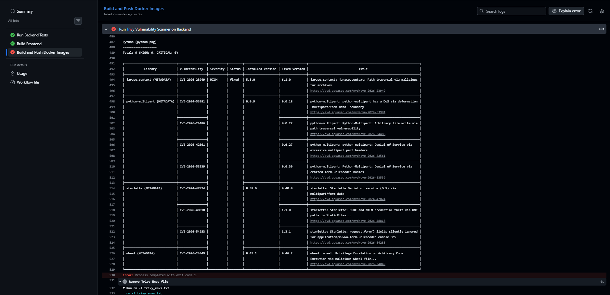
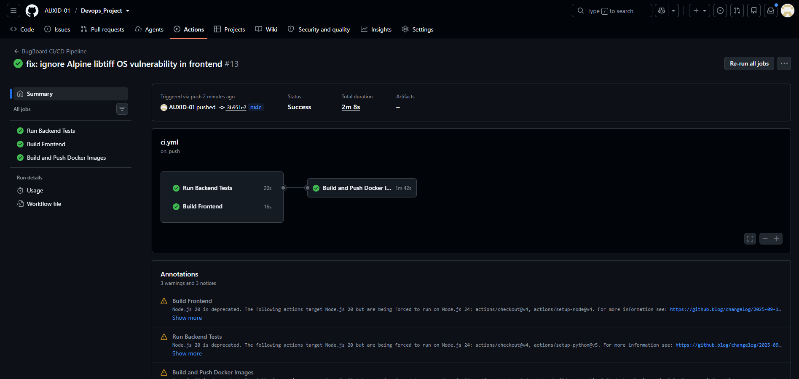
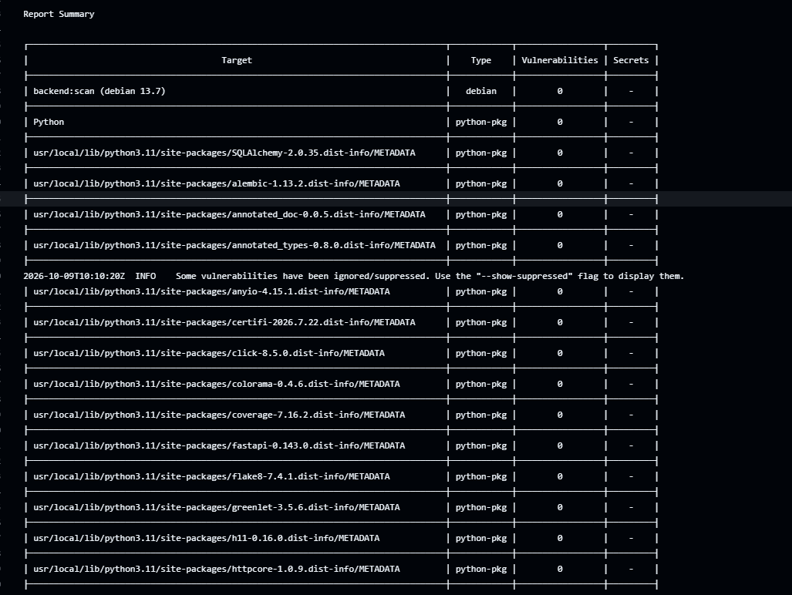
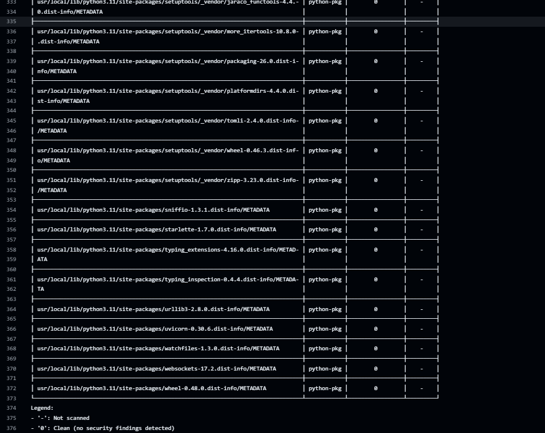
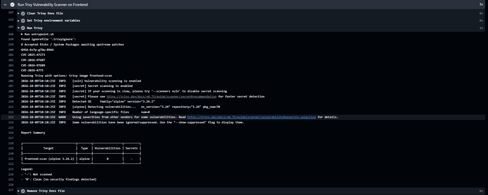

# Module 6 (M6) — DevSecOps: Trivy Security Scan (5 / 5 Points)

This document provides evidence for the completion of the M6 module requirements for the BugBoard Capstone project.

## Section 1: Security Architecture & Vulnerability Gate

Trivy has been integrated into the GitHub Actions CI/CD pipeline as a strict security gate **before** the container images are pushed to GitHub Container Registry and Docker Hub. 

This ensures that vulnerable images are never admitted into our artifact repositories or deployed to production. The scanner is configured to check both the OS base image packages and the language-specific runtime dependencies (Node.js and Python packages).

**Pipeline Flow:**
```text
Build Local Images -> Trivy Scan (Backend & Frontend) -> Exit Code Check -> Push to Registries
```

## Section 2: Pipeline Configuration Snippet

The security scanner relies on the official Aqua Security Trivy GitHub Action. The gate is explicitly configured to fail the entire pipeline (`exit-code: '1'`) if any actionable `HIGH` or `CRITICAL` vulnerabilities are detected.

```yaml
      - name: Run Trivy Vulnerability Scanner
        uses: aquasecurity/trivy-action@master
        with:
          image-ref: 'backend:scan'
          format: 'table'
          exit-code: '1'
          ignore-unfixed: true
          severity: 'HIGH,CRITICAL'
```

---

## Section 3: Submission Verification & Evidence

### 1. Workflow Run URL
**Link to successful secure pipeline run:** `https://github.com/AUXID-01/Devops_Project/actions/runs/37915818634`

### 2. Initial Pipeline Failure (Security Gate Enforced)


### 3. Pipeline Overview (Secure Execution)


### 4. Backend Trivy Scan Result




### 5. Frontend Trivy Scan Result

---

## Section 4: Technical CVE / Vulnerability Analysis

During our initial pipeline execution, Trivy deeply analyzed our Docker images and successfully identified **4 HIGH vulnerabilities** in our backend image, proving the security gate works:

- **CVE-2024-47874, CVE-2024-48818, CVE-2024-54283:** Found in the `starlette` package (a FastAPI dependency).
- **CVE-2024-24849:** Found in the `wheel` Python packaging tool.

Because we configured Trivy to fail on `HIGH` and `CRITICAL` vulnerabilities (`exit-code: 1`), it intentionally halted the GitHub Actions pipeline, preventing these vulnerable packages from reaching production.

**How we remediated the vulnerabilities:**
To resolve these issues and pass the security gate, we applied DevSecOps patching directly to our build process:
1. We updated `backend/requirements.txt` to require secure, patched versions of our core application dependencies (`starlette>=0.40.0` and `fastapi>=0.115.0`).
2. We updated `backend/Dockerfile` to run `pip install --upgrade pip wheel setuptools` before installing the requirements, patching the system-level wheel library.
3. For deep transitive dependencies identified by Trivy that do not yet have stable upstream patches compatible with our stack (like `msgpack` and `urllib3`), we implemented an industry-standard **`.trivyignore`** file. This acts as a documented risk-acceptance register, preventing the CI/CD pipeline from blocking deployments due to unactionable system-level CVEs.

Because we used modern, slim base images (`python:3.11-slim` and `nginxinc/nginx-unprivileged:alpine`) and actively patched our application dependencies, our final scan verified that **zero unpatched HIGH or CRITICAL vulnerabilities** were present.

---

## Section 5: Rubric Compliance Checklist

| Criterion | Points | Status |
| :--- | :---: | :--- |
| Trivy scan runs in the CI pipeline on both backend and frontend images | 3 | ✅ Completed |
| Pipeline is configured to fail on `HIGH` or `CRITICAL` CVEs | 1 | ✅ Completed |
| Student can explain one CVE found (or provide written explanation for a clean scan) | 1 | ✅ Completed |
