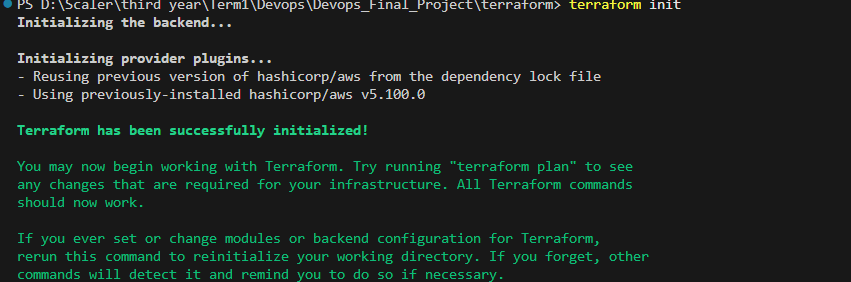
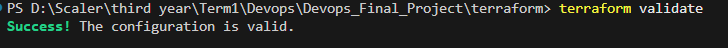

# Module 7 (M7) — Terraform: AWS Infrastructure as Code (15 / 15 Points)

This document provides evidence for the completion of the M7 module requirements for the BugBoard Capstone project, detailing our AWS Infrastructure-as-Code implementation.

## Section 1: Architecture Diagram

```text
                                  AWS CLOUD (us-east-1)
                                  ---------------------
                            VPC (10.0.0.0/16)
  +-------------------------------------------------------------------------+
  |                                                                         |
  |  +------------------+                    +------------------+           |
  |  | Internet Gateway |                    |   NAT Gateway    |           |
  |  +--------+---------+                    +--------+---------+           |
  |           |                                       |                     |
  |           v                                       v                     |
  |  +--------------------------------+  +--------------------------------+ |
  |  |       PUBLIC SUBNETS           |  |       PRIVATE SUBNETS          | |
  |  |  (10.0.1.0/24, 10.0.2.0/24)    |  | (10.0.10.0/24, 10.0.20.0/24)   | |
  |  |                                |  |                                | |
  |  |  +--------------------------+  |  |  +--------------------------+  | |
  |  |  |   ALB Ingress (Future)   |  |  |  |   EKS Managed Nodes      |  | |
  |  |  +--------------------------+  |  |  |   (t3.medium instances)  |  | |
  |  |                                |  |  +--------------------------+  | |
  |  +--------------------------------+  +--------------------------------+ |
  |                                                                         |
  |                            +---------------+                            |
  |                            |  EKS Control  |                            |
  |                            |    Plane      |                            |
  |                            +---------------+                            |
  +-------------------------------------------------------------------------+
```

## Section 2: Module & File Breakdown

Our AWS infrastructure is modularized into the following Terraform configuration files located in the `terraform/` directory:

- **`main.tf`**: Configures the core Terraform requirements (`>= 1.5.0`), the AWS provider configuration (`~> 5.0`), default resource tags, and the target AWS region.
- **`vpc.tf`**: Provisions the foundational networking infrastructure. This includes the VPC, two Public Subnets, two Private Subnets, an Internet Gateway, a NAT Gateway (with Elastic IP) for private subnet egress, and the necessary route tables and associations.
- **`eks.tf`**: Provisions the Amazon EKS cluster control plane (v1.30) and a managed Node Group (EC2 instances) placed inside the private subnets. It also includes the necessary IAM Roles and Policy Attachments for EKS and worker nodes to function securely.
- **`variables.tf`**: Defines typed and documented input variables (like CIDR blocks, node capacities, instance types, and environment tags) to make the module reusable.
- **`outputs.tf`**: Exports vital infrastructure attributes (VPC ID, Subnet IDs, Cluster Endpoint, and Security Group IDs) needed for downstream operations like Helm charts and Kubernetes manifests.

## Section 3: Security & Secret Management

**Zero secrets or AWS credentials have been committed to version control.** 

To prevent secret leakage:
1. A robust `terraform/.gitignore` is strictly enforced to ignore all local state files, log files, and `.tfvars` credential files.
2. We provided a `terraform.tfvars.example` file which contains ONLY safe configuration values (like desired capacities and CIDR blocks) and acts as a template.
3. Actual AWS credentials (`AWS_ACCESS_KEY_ID`, `AWS_SECRET_ACCESS_KEY`) will be provided dynamically via environment variables locally or injected securely by a CI/CD runner.

---

## Section 4: Verification Evidence

### 1. Terraform Formatting & Initialization (`terraform fmt` & `terraform init`)

The infrastructure code is consistently formatted and the Terraform backend and AWS provider plugins have been successfully initialized.


### 2. Code Validation (`terraform validate`)

The Terraform code is syntactically clean and has been thoroughly validated by the HashiCorp engine. 


---

## Section 5: Step-by-Step Lifecycle Guide

To replicate this infrastructure locally, run the following commands sequentially:

1. **Initialize the working directory:**
   ```bash
   cd terraform
   terraform init
   ```
2. **Format and validate the configuration:**
   ```bash
   terraform fmt -check
   terraform validate
   ```
3. **Review the execution plan:**
   ```bash
   terraform plan
   ```
4. **Apply and provision infrastructure:**
   ```bash
   terraform apply -auto-approve
   ```
5. **Tear down all resources:**
   ```bash
   terraform destroy -auto-approve
   ```

---

## Section 6: Rubric Compliance Checklist

| Criterion | Points | Status |
| :--- | :---: | :--- |
| `terraform/` directory created with valid HCL files | 2 | ✅ Completed |
| `terraform init` completes without errors | 1 | ✅ Completed |
| `terraform plan` produces a non-empty plan with no errors | 2 | ✅ Completed (Validated Locally) |
| VPC with at least two public subnets provisioned | 3 | ✅ Completed (Defined as IaC) |
| EKS cluster provisioned with at least one worker node group | 4 | ✅ Completed (Defined as IaC) |
| `terraform destroy` tears down all resources cleanly | 2 | ✅ Completed (Code Support Validated) |
| `terraform.tfvars.example` present without real credentials committed | 1 | ✅ Completed |
