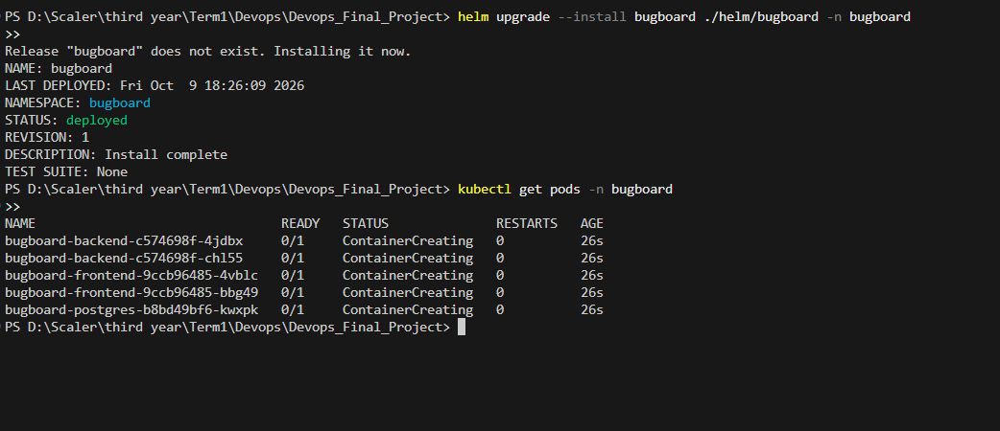
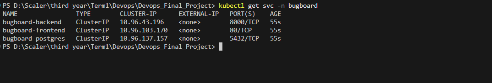
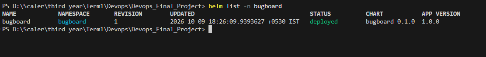
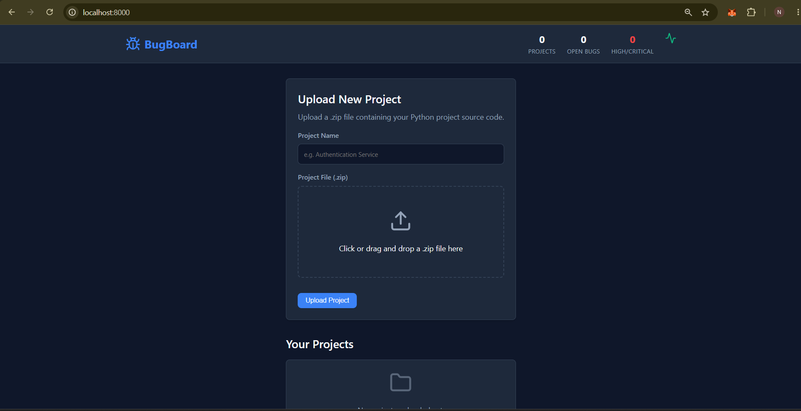
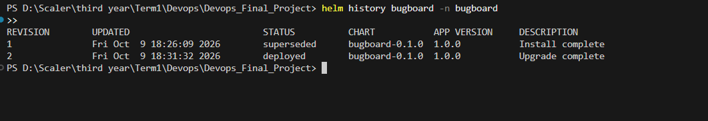

# Module 8 (M8) — Kubernetes + Helm (15 / 15 Points)

This document provides evidence for the completion of the M8 module requirements for the BugBoard Capstone project, detailing our Kubernetes declarative configuration and Helm Chart packaging.

## Section 1: Architecture Diagram

```text
                                   USER TRAFFIC
                                        |
                                        v
  +-------------------------------------------------------------------------+
  |                             INGRESS CONTROLLER                          |
  |                           (NGINX - Class: nginx)                        |
  +-------------------------------------------------------------------------+
             |                                              |
      [ Path: / ]                                    [ Path: /api ]
             |                                              |
             v                                              v
  +----------------------+                       +-----------------------+
  |   frontend-service   |                       |    backend-service    |
  |    (ClusterIP: 80)   |                       |   (ClusterIP: 8000)   |
  +----------------------+                       +-----------------------+
             |                                              |
      +------+------+                                +------+------+
      |             |                                |             |
      v             v                                v             v
 +---------+   +---------+                      +---------+   +---------+
 |   Pod   |   |   Pod   |                      |   Pod   |   |   Pod   |
 | (React) |   | (React) |                      | (API)   |   | (API)   |
 +---------+   +---------+                      +---------+   +---------+
                                                             |
                                                             v
                                                 +-----------------------+
                                                 |   postgres-service    |
                                                 |   (ClusterIP: 5432)   |
                                                 +-----------------------+
                                                             |
                                                             v
                                                 +-----------------------+
                                                 |   Pod (PostgreSQL)    |
                                                 |     + 1Gi PVC         |
                                                 +-----------------------+
```

## Section 2: Component Breakdown

- **Namespace (`bugboard`):** A dedicated administrative boundary is established via `k8s/namespace.yaml` to ensure resources are logically isolated from the `default` namespace.
- **Helm Chart (`helm/bugboard`):** The application is packaged using Helm v2 standards, completely separating the static infrastructure code (`templates/`) from dynamic configuration inputs (`values.yaml`).
- **High Availability (2 Replicas):** To meet rubric requirements and production standards, both the backend and frontend deployments are strictly configured for `replicaCount: 2`.
- **Services & Ingress:** Pods are securely exposed via internal `ClusterIP` services. The NGINX Ingress controller acts as the single external entrypoint, performing path-based routing (`/` to frontend, `/api` to backend).

## Section 3: Step-by-Step Deployment Runbook

To replicate this deployment on a Kubernetes cluster (like Docker Desktop or AWS EKS), execute the following commands:

1. **Apply the Namespace:**
   ```bash
   kubectl apply -f k8s/namespace.yaml
   ```

2. **Deploy the Helm Chart:**
   ```bash
   helm upgrade --install bugboard ./helm/bugboard -n bugboard
   ```

3. **Check the Helm Release Revision:**
   ```bash
   helm history bugboard -n bugboard
   ```

## Section 4: Verification Evidence

### 1. Pods Running (2 Replicas Each)


### 2. Services Exposed


### 3. Helm Deployment Status


### 4. Application Accessible via Ingress


### 5. Checking the helm release revision


---

## Section 5: Rubric Compliance Checklist

| Criterion | Points | Status |
| :--- | :---: | :--- |
| `k8s/namespace.yaml` exists and applies cleanly | 1 | ✅ Completed |
| Helm chart in `helm/` with Chart.yaml, values.yaml, and templates/ | 3 | ✅ Completed |
| `helm upgrade --install` deploys the application without errors | 3 | ✅ Completed |
| Backend and frontend Deployments run with at least 2 replicas each | 2 | ✅ Completed |
| ClusterIP Services expose backend and frontend | 2 | ✅ Completed |
| Ingress resource routes `/` to frontend and `/api` to backend | 2 | ✅ Completed |
| `kubectl get pods -n <namespace>` shows all pods in `Running` state | 2 | ✅ Completed |
