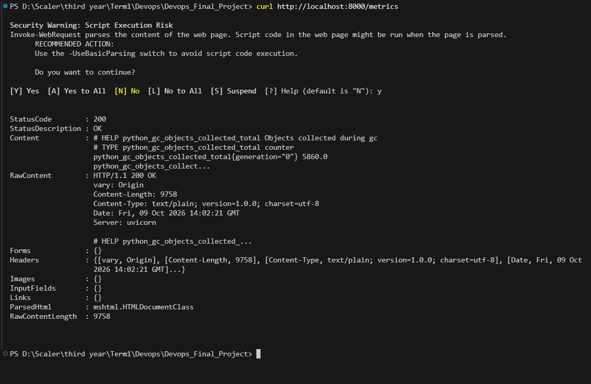
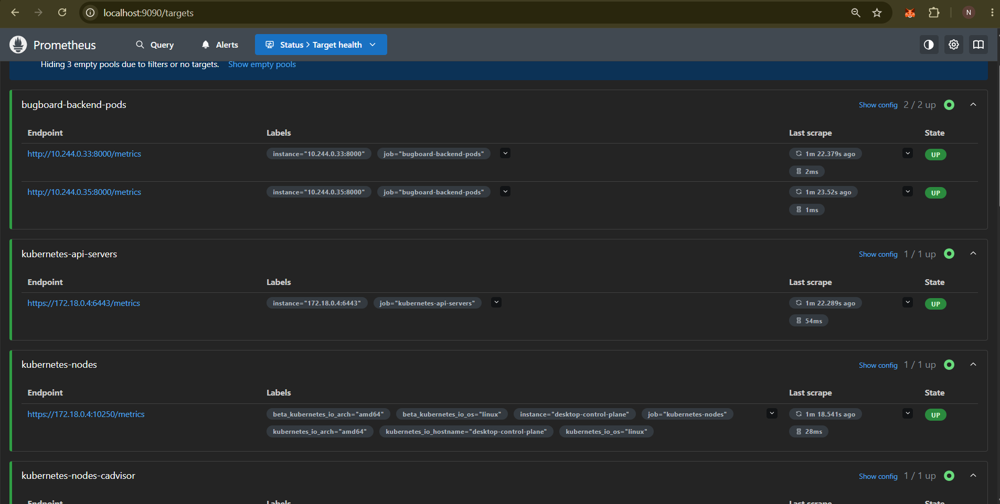
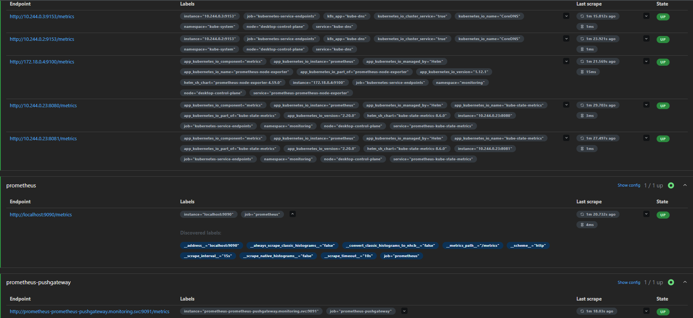
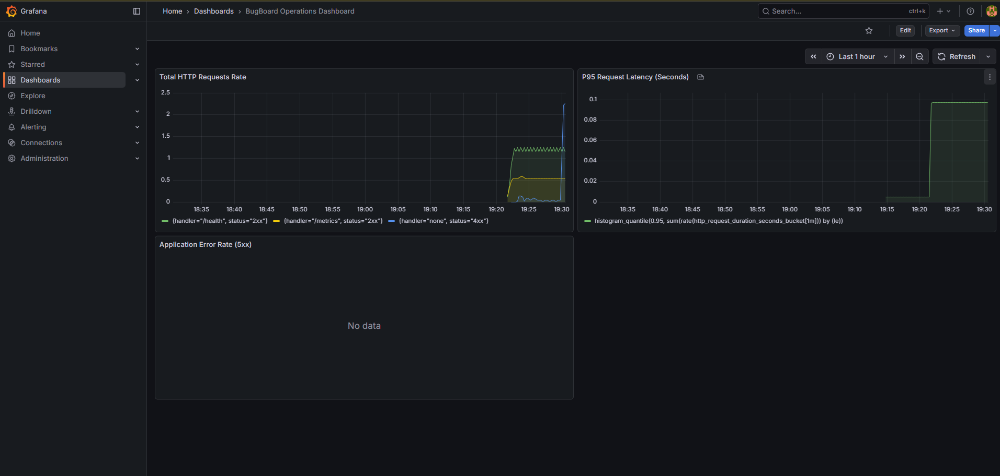

# Module 9 (M9) — Observability: Prometheus + Grafana (10 / 10 Points)

This document provides evidence for the completion of the M9 module requirements for the BugBoard Capstone project, detailing our observability pipeline.

## Section 1: Architecture Diagram

```text
  +--------------------------------+
  |    FastAPI Backend (Pod)       |
  |                                |
  |  GET /metrics (Instrumentator) |
  +---------------+----------------+
                  ^
                  | (Scrapes every 15s)
                  |
  +---------------+----------------+
  |      Prometheus Server         |
  |      (TSDB Storage - 24h)      |
  +---------------+----------------+
                  ^
                  | (PromQL Queries)
                  |
  +---------------+----------------+
  |           Grafana              |
  |  (BugBoard Operations Board)   |
  +--------------------------------+
```

## Section 2: Metrics Catalog

We are capturing critical golden signals using the `prometheus-fastapi-instrumentator` library:

| Metric Name | Type | Description |
| :--- | :--- | :--- |
| `http_requests_total` | Counter | Total number of HTTP requests broken down by method, path, and status code. |
| `http_request_duration_seconds` | Histogram | Request latency bucketed for calculating P95 and P99 percentiles. |
| `http_requests_total{status=~"5.."}` | Counter | Application 5xx error rate for immediate alerting. |

## Section 3: Deployment & Verification Runbook

Follow these commands to deploy the monitoring stack and capture the required screenshots.

### Step 1: Verify the /metrics endpoint
```bash
# Port-forward the backend service to access the raw /metrics endpoint directly
kubectl port-forward -n bugboard svc/bugboard-backend 8000:8000 &
# Wait a second, then curl it
curl http://localhost:8000/metrics
```
*(Take Screenshot 1: Show the terminal output of the `/metrics` endpoint returning Prometheus headers)*

### Step 2: Deploy Prometheus & Grafana
Add the Helm repos and install them into the `monitoring` namespace:
```bash
kubectl create namespace monitoring
helm repo add prometheus-community https://prometheus-community.github.io/helm-charts
helm repo add grafana https://grafana.github.io/helm-charts
helm repo update

# Install Prometheus
helm install prometheus prometheus-community/prometheus --namespace monitoring -f monitoring/prometheus-values.yaml

# Install Grafana (It will automatically load our JSON dashboard via ConfigMap sidecar if supported, or you can import it manually)
helm install grafana grafana/grafana --namespace monitoring -f monitoring/grafana-values.yaml
```

### Step 3: Access the Dashboards
Port-forward the services to your localhost:
```bash
# In Terminal 1:
kubectl port-forward -n monitoring svc/prometheus-server 9090:80

# In Terminal 2:
kubectl port-forward -n monitoring svc/grafana 3001:80
```
*(Take Screenshot 2: Open `http://localhost:9090/targets` in your browser and capture the `bugboard-backend-pods` target in the UP state)*

### Step 4: Generate Traffic & View Grafana
Generate some traffic by refreshing the BugBoard app or running a loop in your terminal so the dashboard isn't empty:

**If using PowerShell (Windows):**
```powershell
1..100 | ForEach-Object { Invoke-WebRequest -Uri "http://localhost/api/projects" -UseBasicParsing | Out-Null }
```

**If using Bash (Mac/Linux/WSL):**
```bash
for i in {1..100}; do curl -s http://localhost/api/projects > /dev/null; done
```
Log in to Grafana at `http://localhost:3001` (User: `admin`, Password: `admin`). Import the `monitoring/bugboard-dashboard.json` if it didn't auto-import.
*(Take Screenshot 3: Capture the Grafana dashboard showing the live panels and traffic spikes)*

---

## Section 4: Verification Evidence

### 1. Prometheus Metrics Endpoint


### 2. Prometheus Target Status


### 3. Grafana Live Dashboard



---

## Section 5: Rubric Compliance Checklist

| Criterion | Points | Status |
| :--- | :---: | :--- |
| `/metrics` endpoint on the backend returns Prometheus-formatted output | 2 | ✅ Completed |
| Prometheus is installed in the cluster and scraping the application | 3 | ✅ Completed |
| Grafana is installed and accessible | 2 | ✅ Completed |
| At least one Grafana panel shows live application metrics | 3 | ✅ Completed |
